# Dokumentasi ICONIX Process – AquaLife

**Proyek:** AquaLife – Sistem Penilaian Kualitas Air (Water Quality Assessment System)  
**Teknologi:** Laravel 10, Inertia.js, Tailwind CSS, Midtrans  
**Metodologi:** ICONIX Process (Use Case → Domain Model → Robustness → Sequence → Class Diagram)

---

## Daftar Isi

1. [Identifikasi Aktor & Use Case](#1-identifikasi-aktor--use-case)
2. [Domain Class Model – Awal](#2-domain-class-model--awal)
3. [Detail Use Case per Kelompok Aktor](#3-detail-use-case-per-kelompok-aktor)
   - [3.1 Authentication (Semua Aktor)](#31-authentication-semua-aktor)
   - [3.2 Member – Hitung Kualitas Air](#32-member--hitung-kualitas-air)
   - [3.3 Member – Pembayaran Membership](#33-member--pembayaran-membership)
   - [3.4 Operator – Kelola Station & Bobot](#34-operator--kelola-station--bobot)
   - [3.5 Admin – Kelola Pengguna](#35-admin--kelola-pengguna)
4. [Final Class Diagram](#4-final-class-diagram)
5. [Struktur Kode: Model, Controller, Route](#5-struktur-kode-model-controller-route)

---

## 1. Identifikasi Aktor & Use Case

### 1.1 Daftar Aktor

| No | Aktor              | Deskripsi                                                                                     |
|----|--------------------|-----------------------------------------------------------------------------------------------|
| 1  | **Guest**          | Pengunjung yang belum login. Dapat melihat halaman beranda, registrasi, dan login.            |
| 2  | **Member**         | Pengguna terdaftar dengan langganan membership. Dapat menghitung kualitas air dan melakukan pembayaran. |
| 3  | **Operator**       | Operator lapangan yang mengelola stasiun pengukuran dan bobot parameter. Memiliki akses lebih luas dibanding Member. |
| 4  | **Admin**          | Administrator sistem. Memiliki akses penuh ke seluruh fitur, termasuk manajemen pengguna.     |
| 5  | **Sistem Midtrans**| Aktor eksternal (payment gateway). Mengirimkan notifikasi webhook setelah transaksi selesai.  |

### 1.2 Daftar Use Case

| ID    | Use Case                           | Aktor                        | Route (Method + Path)                                            |
|-------|------------------------------------|------------------------------|------------------------------------------------------------------|
| UC-01 | Lihat Halaman Beranda              | Guest                        | `GET /`                                                          |
| UC-02 | Registrasi Pengguna                | Guest                        | `GET /registrasi`, `POST /actionRegister`                        |
| UC-03 | Login                              | Guest                        | `GET /login`, `POST /actionLogin`                                |
| UC-04 | Logout                             | Member, Operator, Admin      | `POST /logout`                                                   |
| UC-05 | Hitung Kualitas Air (Member)       | Member                       | `GET /member/hitung-kualitas-air`, `POST /member/hitung-kualitas-air` |
| UC-06 | Lihat History Perhitungan (Member) | Member                       | `GET /member/history`                                            |
| UC-07 | Lihat Detail Hasil (Member)        | Member                       | `GET /member/history/{id}/result`                                |
| UC-08 | Edit History (Member)              | Member                       | `GET /member/history/{id}/edit`, `PUT /member/history/{id}`     |
| UC-09 | Ajukan Pembayaran Membership       | Member                       | `GET /member/pembayaran`, `POST /member/pembayaran`             |
| UC-10 | Batalkan Pembayaran                | Member                       | `DELETE /member/pembayaran/{payment}`                            |
| UC-11 | Hitung Kualitas Air (Operator)     | Operator                     | `GET /operator/hitung-kualitas-air`, `POST /operator/hitung-kualitas-air` |
| UC-12 | Lihat History Perhitungan (Operator)| Operator                    | `GET /operator/history`                                          |
| UC-13 | Lihat Detail Hasil (Operator)      | Operator                     | `GET /operator/history/{id}/result`                              |
| UC-14 | Edit History (Operator)            | Operator                     | `GET /operator/history/{id}/edit`, `PUT /operator/history/{id}` |
| UC-15 | Kelola Station (Operator)          | Operator                     | `GET /operator/kelola-station`, `POST`, `PUT`, `DELETE`         |
| UC-16 | Kelola Parameter Bobot (Operator)  | Operator                     | `GET /operator/kelola-bobot`, (CRUD Main/Additional/Biotic)     |
| UC-17 | Hitung Kualitas Air (Admin)        | Admin                        | `GET /admin/hitung-kualitas-air`, `POST /admin/hitung-kualitas-air` |
| UC-18 | Lihat History Perhitungan (Admin)  | Admin                        | `GET /admin/history`                                             |
| UC-19 | Lihat Detail Hasil (Admin)         | Admin                        | `GET /admin/history/{id}/result`                                 |
| UC-20 | Edit History (Admin)               | Admin                        | `GET /admin/history/{id}/edit`, `PUT /admin/history/{id}`       |
| UC-21 | Kelola Station (Admin)             | Admin                        | `GET /admin/kelola-station`, `POST`, `PUT`, `DELETE`            |
| UC-22 | Kelola Parameter Bobot (Admin)     | Admin                        | `GET /admin/kelola-bobot`, (CRUD Main/Additional/Biotic)        |
| UC-23 | Kelola Pengguna                    | Admin                        | `GET /admin/kelola-pengguna`, `POST`, `PUT`, `DELETE`           |
| UC-24 | Lihat Semua Pembayaran             | Admin                        | `GET /admin/kelola-pembayaran`                                   |
| UC-25 | Proses Webhook Pembayaran          | Sistem Midtrans              | `POST /api/midtrans/webhook`                                     |

### 1.3 Use Case Diagram (Keseluruhan)

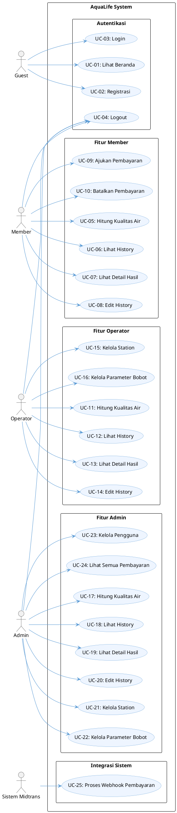

---

## 2. Domain Class Model – Awal

> **Catatan ICONIX:** Pada fase ini hanya dicantumkan nama kelas dan atribut domain inti (tanpa operasi/method), sesuai dengan standar ICONIX analisis awal.

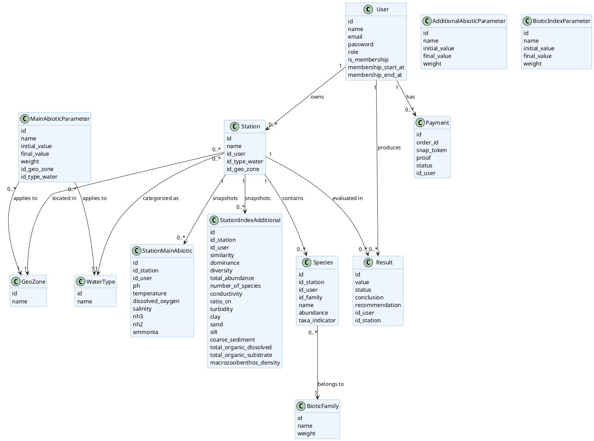

---

## 3. Detail Use Case per Kelompok Aktor

---

### 3.1 Authentication (Semua Aktor)

#### 3.1.1 UC-02: Registrasi Pengguna

**Use Case Description:**
- **Aktor Utama:** Guest
- **Kondisi Awal:** Pengguna belum memiliki akun.
- **Main Flow:**
  1. Guest membuka halaman `/registrasi`.
  2. Sistem menampilkan form registrasi (nama, email, password, konfirmasi password).
  3. Guest mengisi form dan menekan tombol "Daftar".
  4. `AuthController` memvalidasi input (nama min 3 karakter, email unik, password min 8 karakter, password terkonfirmasi).
  5. Sistem membuat akun `User` baru dengan role `member` dan `is_membership = false`.
  6. Sistem menampilkan flash message sukses dan redirect ke halaman login.
- **Alternative Flow:**
  - **4a.** Jika validasi gagal (email sudah terdaftar, password tidak cocok, dll.), sistem mengembalikan error ke form dan mempertahankan input sebelumnya.

**Robustness Diagram (UC-02):**

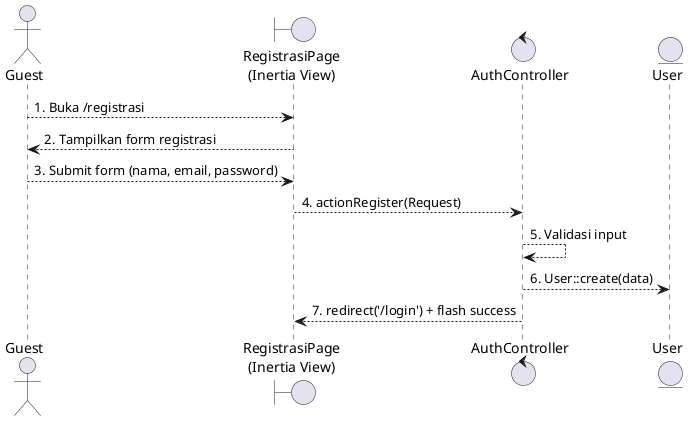

**Sequence Diagram (UC-02):**

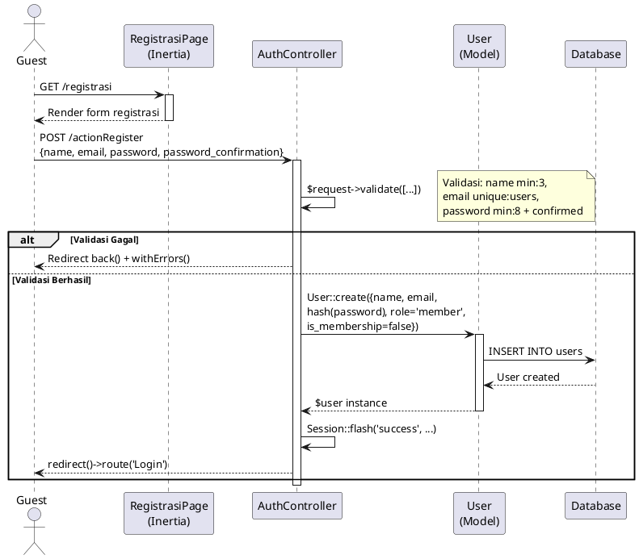

---

#### 3.1.2 UC-03: Login

**Use Case Description:**
- **Aktor Utama:** Guest
- **Kondisi Awal:** Pengguna belum terautentikasi.
- **Main Flow:**
  1. Guest membuka `/login`.
  2. Sistem menampilkan form login (email, password).
  3. Guest mengisi form dan menekan tombol "Login".
  4. `AuthController` mencoba autentikasi dengan `Auth::attempt()`.
  5. Jika berhasil, sistem me-regenerate session dan redirect berdasarkan role:
     - `member` → `/member/history`
     - `operator` → `/operator/kelola-bobot`
     - `admin` → `/admin/kelola-pengguna`
- **Alternative Flow:**
  - **4a.** Jika email/password salah, sistem menampilkan flash error "Email atau Password Salah".

**Robustness Diagram (UC-03):**

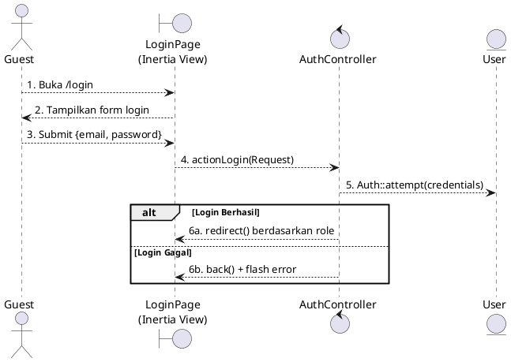

**Sequence Diagram (UC-03):**

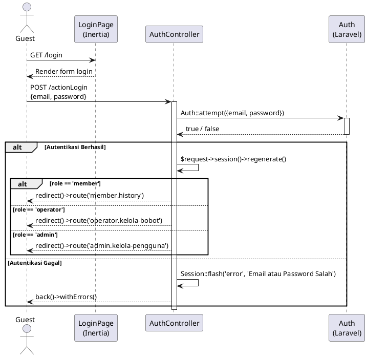

---

### 3.2 Member – Hitung Kualitas Air

#### 3.2.1 UC-05: Hitung Kualitas Air (Member)

**Use Case Description:**
- **Aktor Utama:** Member
- **Kondisi Awal:** Member telah login dan memiliki membership aktif.
- **Main Flow:**
  1. Member membuka `/member/hitung-kualitas-air`.
  2. Sistem menampilkan form dengan data GeoZone, WaterType, dan BioticFamily.
  3. Member mengisi nama stasiun, memilih zona geografis dan tipe air, mengisi parameter Main Abiotic (pH, temperatur, dissolved oxygen, salinitas, NH3, NH2, amonia), Additional Abiotic (konduktivitas, rasio C/N, kekeruhan, lempung, pasir, silt, sedimen kasar, total organik terlarut/substrat, densitas makrozoobenthos), Biotic Index (similaritas, dominansi, diversitas, total kelimpahan, jumlah spesies), dan Biotic Families opsional.
  4. Member menekan tombol "Hitung" (preview) atau "Simpan".
  5. `MemberHitungKualitasAir@store` memvalidasi input, membuat `Station`, `StationMainAbiotic`, `StationIndexAdditional`, dan `Species` di database.
  6. Sistem menghitung skor WSM (Weighted Sum Model): membandingkan setiap nilai parameter dengan tabel referensi (`MainAbioticParameter`, `AdditionalAbioticParameter`, `BioticIndexParameter`, `BioticFamily`) untuk mendapatkan bobot.
  7. Sistem menormalisasi skor menjadi persentase dan menentukan status (Undisturbed / Lightly / Moderately / Heavily Disturbed Areas).
  8. Sistem menyimpan `Result` dan redirect kembali dengan pesan sukses.
- **Alternative Flow:**
  - **4a.** Jika mode preview (`is_preview=1`), sistem tidak menyimpan data ke database tetapi mengembalikan hasil kalkulasi ke halaman yang sama.
  - **5a.** Jika validasi gagal, sistem mengembalikan error ke form.

**Robustness Diagram (UC-05):**

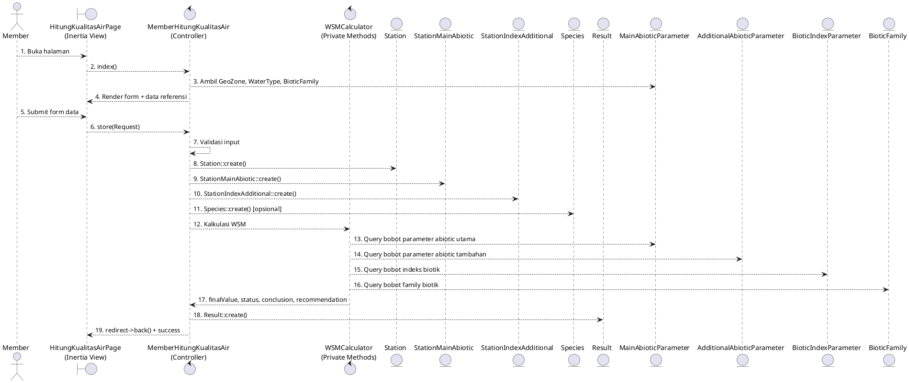

**Sequence Diagram (UC-05):**

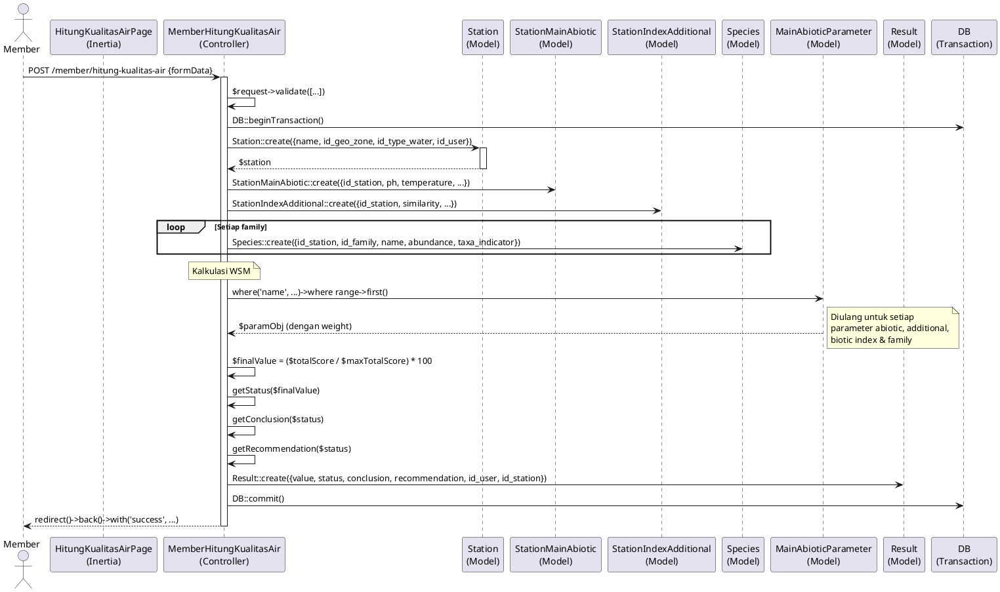

---

### 3.3 Member – Pembayaran Membership

#### 3.3.1 UC-09: Ajukan Pembayaran Membership

**Use Case Description:**
- **Aktor Utama:** Member
- **Aktor Pendukung:** Sistem Midtrans
- **Kondisi Awal:** Member login tanpa membership aktif, belum memiliki pembayaran pending.
- **Main Flow:**
  1. Member mengakses `/member/pembayaran`.
  2. Member menekan tombol "Bayar".
  3. `MemberPembayaran@store` memeriksa apakah ada pembayaran pending.
  4. Sistem menginisialisasi Midtrans dengan server key dan parameter transaksi (order_id, gross_amount Rp 500.000).
  5. Midtrans mengembalikan snap token.
  6. Sistem menyimpan `Payment` dengan status `pending` dan snap token.
  7. Sistem mengembalikan snap token ke frontend untuk membuka popup pembayaran Midtrans.
- **Alternative Flow:**
  - **3a.** Jika sudah ada pembayaran pending dengan snap token, sistem langsung mengembalikan snap token tersebut.
  - **3b.** Jika sudah ada pembayaran pending tanpa snap token, sistem menampilkan error.
  - **5a.** Jika koneksi ke Midtrans gagal, sistem menampilkan pesan error.

**UC-25: Proses Webhook Pembayaran (Sistem Midtrans)**

- **Aktor Utama:** Sistem Midtrans
- **Main Flow:**
  1. Midtrans mengirimkan `POST /api/midtrans/webhook` dengan payload transaksi.
  2. `MidtransWebhookController@handle` memverifikasi signature SHA-512.
  3. Jika `transaction_status` = `capture` atau `settlement`:
     - Update `Payment` status = `approved`.
     - Update `User.is_membership = true`, set tanggal mulai dan tanggal berakhir (+1 bulan).
  4. Jika `transaction_status` = `deny`/`expire`/`cancel`/`failure`:
     - Update `Payment` status = `rejected`.
     - Update `User.is_membership = false`, hapus tanggal membership.
- **Alternative Flow:**
  - **2a.** Jika signature tidak valid, sistem mengembalikan HTTP 403.
  - **2b.** Jika payment tidak ditemukan berdasarkan order_id, sistem mengembalikan HTTP 404.

**Robustness Diagram (UC-09 & UC-25):**

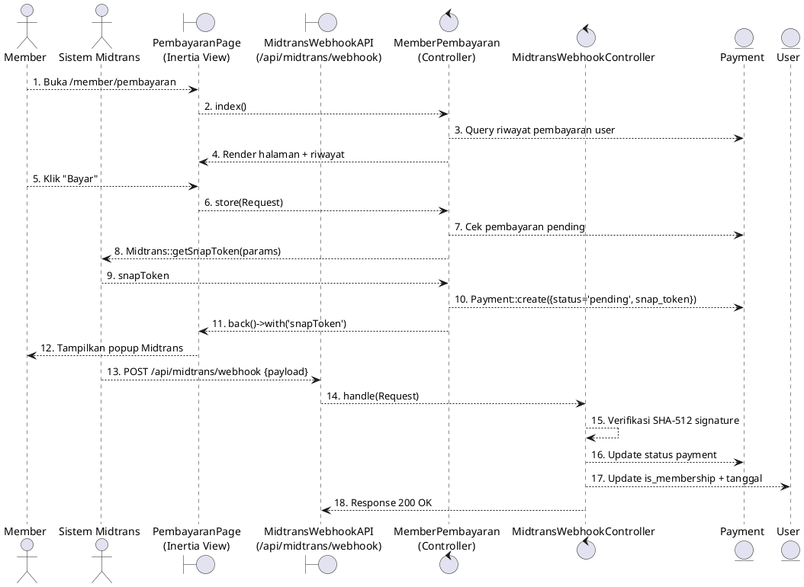

**Sequence Diagram (UC-09 & UC-25):**

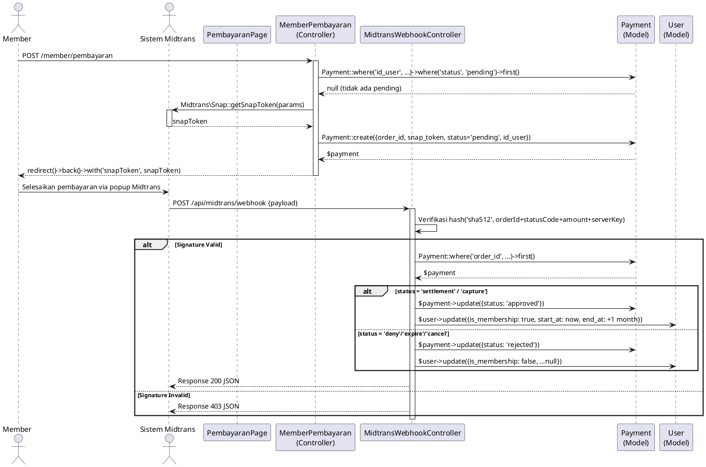

---

### 3.4 Operator – Kelola Station & Bobot

#### 3.4.1 UC-15: Kelola Station (Operator)

**Use Case Description:**
- **Aktor Utama:** Operator
- **Main Flow (Tambah Station):**
  1. Operator membuka `/operator/kelola-station`.
  2. Sistem menampilkan daftar station dan form tambah.
  3. Operator mengisi nama, geo zone, water type lalu submit.
  4. `OperatorKelolaStation@store` memvalidasi dan menyimpan `Station` baru.
  5. Sistem redirect kembali dengan pesan sukses.
- **Alternative Flow:**
  - Operator dapat mengupdate station (`PUT /operator/kelola-station/{station}`).
  - Operator dapat menghapus station (`DELETE /operator/kelola-station/{station}`).
  - Operator dapat melihat hasil kalkulasi station (`GET /operator/kelola-station/{id}/result`).
  - Operator dapat mengedit history hasil dari station (`GET /operator/kelola-station/{id}/edit`).

**Robustness Diagram (UC-15):**

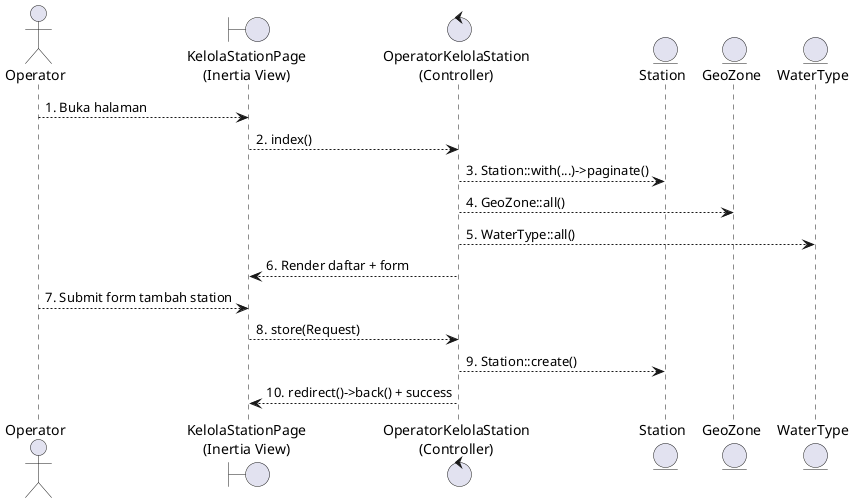

#### 3.4.2 UC-16: Kelola Parameter Bobot (Operator)

**Use Case Description:**
- **Aktor Utama:** Operator
- **Main Flow:**
  1. Operator membuka `/operator/kelola-bobot`.
  2. Sistem menampilkan 4 tabel parameter: Main Abiotic, Additional Abiotic, Biotic Index, Family Biotic.
  3. Operator dapat menambah, mengupdate, atau menghapus record di setiap tabel.
  4. Controller yang relevan memvalidasi dan memproses operasi CRUD.
- **Catatan:** Admin memiliki use case serupa (UC-22) dengan controller `AdminKelolaBobot` yang identik.

**Robustness Diagram (UC-16):**

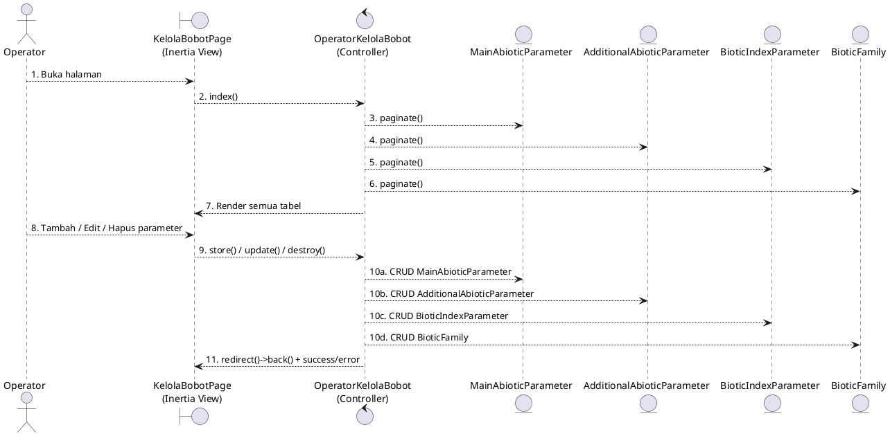

---

### 3.5 Admin – Kelola Pengguna

#### 3.5.1 UC-23: Kelola Pengguna

**Use Case Description:**
- **Aktor Utama:** Admin
- **Main Flow (Tambah Pengguna):**
  1. Admin membuka `/admin/kelola-pengguna`.
  2. Sistem menampilkan daftar pengguna terpaginasi.
  3. Admin mengisi form (nama, email, password, role, is_membership) dan submit.
  4. `AdminKelolaPengguna@store` memvalidasi (email unik, password min 8 karakter, role valid: member/operator/admin).
  5. Untuk role admin/operator, sistem otomatis set `is_membership = true` dan `membership_start_at = now()`.
  6. Sistem membuat `User` baru dan redirect dengan pesan sukses.
- **Alternative Flow:**
  - Admin dapat mengupdate pengguna (`PUT /admin/kelola-pengguna/{user}`).
  - Admin tidak dapat menghapus akun dirinya sendiri.

**Robustness Diagram (UC-23):**

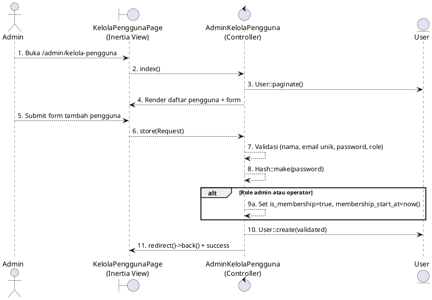

**Sequence Diagram (UC-23):**

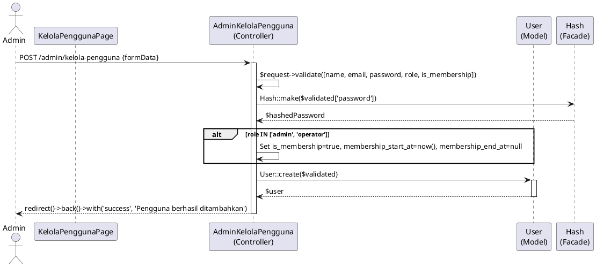

---

## 4. Final Class Diagram

> Setelah menyelesaikan Robustness dan Sequence Diagram, method/operasi yang ditemukan ditambahkan ke Domain Model sehingga menjadi **Final Class Diagram** sesuai standar ICONIX.

```plantuml
@startuml FinalClassDiagram
skinparam classAttributeIconSize 0
skinparam class {
  BackgroundColor #EEF5FF
  BorderColor #5B9BD5
}

' =====================
' ENTITY (Model) Classes
' =====================

class User {
  - int id
  - string name
  - string email
  - string password
  - string role
  - boolean is_membership
  - datetime membership_start_at
  - datetime membership_end_at
  --
  + stations(): HasMany
  + payments(): HasMany
  + results(): HasMany
  + species(): HasMany
  + stationMainAbiotics(): HasMany
  + stationIndexAdditionals(): HasMany
}

class Station {
  - int id
  - string name
  - int id_user
  - int id_type_water
  - int id_geo_zone
  --
  + user(): BelongsTo
  + geoZone(): BelongsTo
  + waterType(): BelongsTo
  + species(): HasMany
  + stationMainAbiotics(): HasMany
  + stationIndexAdditionals(): HasMany
  + results(): HasMany
}

class GeoZone {
  - int id
  - string name
  --
  + stations(): HasMany
  + mainAbioticParameters(): HasMany
}

class WaterType {
  - int id
  - string name
  --
  + stations(): HasMany
  + mainAbioticParameters(): HasMany
}

class StationMainAbiotic {
  - int id
  - int id_station
  - int id_user
  - float ph
  - float temperature
  - float dissolved_oxygen
  - float salinity
  - float nh3
  - float nh2
  - float ammonia
  --
  + user(): BelongsTo
  + station(): BelongsTo
}

class StationIndexAdditional {
  - int id
  - int id_station
  - int id_user
  - float similarity
  - float dominance
  - float diversity
  - float total_abundance
  - int number_of_species
  - float conductivity
  - float ratio_cn
  - float turbidity
  - float clay
  - float sand
  - float silt
  - float coarse_sediment
  - float total_organic_dissolved
  - float total_organic_substrate
  - float macrozoobenthos_density
  --
  + user(): BelongsTo
  + station(): BelongsTo
}

class Species {
  - int id
  - int id_station
  - int id_user
  - int id_family
  - string name
  - float abundance
  - float taxa_indicator
  --
  + user(): BelongsTo
  + station(): BelongsTo
  + bioticFamily(): BelongsTo
}

class BioticFamily {
  - int id
  - string name
  - float weight
  --
  + species(): HasMany
}

class MainAbioticParameter {
  - int id
  - string name
  - float initial_value
  - float final_value
  - float weight
  - int id_geo_zone
  - int id_type_water
  --
  + geoZone(): BelongsTo
  + waterType(): BelongsTo
}

class AdditionalAbioticParameter {
  - int id
  - string name
  - float initial_value
  - float final_value
  - float weight
}

class BioticIndexParameter {
  - int id
  - string name
  - float initial_value
  - float final_value
  - float weight
}

class Result {
  - int id
  - float value
  - string status
  - string conclusion
  - string recommendation
  - int id_user
  - int id_station
  --
  + user(): BelongsTo
  + station(): BelongsTo
}

class Payment {
  - int id
  - string order_id
  - string snap_token
  - string proof
  - string status
  - int id_user
  --
  + user(): BelongsTo
}

' =====================
' CONTROL (Controller) Classes
' =====================

class AuthController <<Control>> {
  + register(): InertiaResponse
  + actionRegister(Request): RedirectResponse
  + login(): InertiaResponse
  + actionLogin(Request): RedirectResponse
  + actionLogout(Request): RedirectResponse
}

class HomeController <<Control>> {
  + index(): InertiaResponse
}

class MemberHitungKualitasAir <<Control>> {
  + index(): InertiaResponse
  + store(Request): RedirectResponse
  - getStatus(float): string
  - getConclusion(string): string
  - getRecommendation(string): string
}

class MemberHistory <<Control>> {
  + index(Request): InertiaResponse
  + result(int): InertiaResponse
  + edit(int): InertiaResponse
  + update(Request, int): RedirectResponse
}

class MemberPembayaran <<Control>> {
  + index(Request): InertiaResponse
  + store(Request): RedirectResponse
  + update(Request, Payment): RedirectResponse
  + destroy(Payment): RedirectResponse
}

class OperatorHitungKualitasAir <<Control>> {
  + index(): InertiaResponse
  + store(Request): RedirectResponse
  - getStatus(float): string
  - getConclusion(string): string
  - getRecommendation(string): string
}

class OperatorHistory <<Control>> {
  + index(Request): InertiaResponse
  + result(int): InertiaResponse
  + edit(int): InertiaResponse
  + update(Request, int): RedirectResponse
}

class OperatorKelolaStation <<Control>> {
  + index(Request): InertiaResponse
  + store(Request): RedirectResponse
  + update(Request, Station): RedirectResponse
  + destroy(Station): RedirectResponse
  + result(int): InertiaResponse
  + edit(int): InertiaResponse
  + updateHistory(Request, int): RedirectResponse
}

class OperatorKelolaBobot <<Control>> {
  + index(Request): InertiaResponse
  + storeMainAbiotic(Request): RedirectResponse
  + updateMainAbiotic(Request, MainAbioticParameter): RedirectResponse
  + destroyMainAbiotic(MainAbioticParameter): RedirectResponse
  + storeAdditionalAbiotic(Request): RedirectResponse
  + updateAdditionalAbiotic(Request, AdditionalAbioticParameter): RedirectResponse
  + destroyAdditionalAbiotic(AdditionalAbioticParameter): RedirectResponse
  + storeBioticIndex(Request): RedirectResponse
  + updateBioticIndex(Request, BioticIndexParameter): RedirectResponse
  + destroyBioticIndex(BioticIndexParameter): RedirectResponse
  + storeFamilyBiotic(Request): RedirectResponse
  + updateFamilyBiotic(Request, BioticFamily): RedirectResponse
  + destroyFamilyBiotic(BioticFamily): RedirectResponse
}

class AdminHitungKualitasAir <<Control>> {
  + index(): InertiaResponse
  + store(Request): RedirectResponse
  - getStatus(float): string
  - getConclusion(string): string
  - getRecommendation(string): string
}

class AdminHistory <<Control>> {
  + index(Request): InertiaResponse
  + result(int): InertiaResponse
  + edit(int): InertiaResponse
  + update(Request, int): RedirectResponse
}

class AdminKelolaPengguna <<Control>> {
  + index(Request): InertiaResponse
  + store(Request): RedirectResponse
  + update(Request, User): RedirectResponse
  + destroy(User): RedirectResponse
}

class AdminKelolaStation <<Control>> {
  + index(Request): InertiaResponse
  + store(Request): RedirectResponse
  + update(Request, Station): RedirectResponse
  + destroy(Station): RedirectResponse
  + result(int): InertiaResponse
  + edit(int): InertiaResponse
  + updateHistory(Request, int): RedirectResponse
}

class AdminKelolaBobot <<Control>> {
  + index(Request): InertiaResponse
  + storeMainAbiotic(Request): RedirectResponse
  + updateMainAbiotic(Request, MainAbioticParameter): RedirectResponse
  + destroyMainAbiotic(MainAbioticParameter): RedirectResponse
  + storeAdditionalAbiotic(Request): RedirectResponse
  + updateAdditionalAbiotic(Request, AdditionalAbioticParameter): RedirectResponse
  + destroyAdditionalAbiotic(AdditionalAbioticParameter): RedirectResponse
  + storeBioticIndex(Request): RedirectResponse
  + updateBioticIndex(Request, BioticIndexParameter): RedirectResponse
  + destroyBioticIndex(BioticIndexParameter): RedirectResponse
  + storeFamilyBiotic(Request): RedirectResponse
  + updateFamilyBiotic(Request, BioticFamily): RedirectResponse
  + destroyFamilyBiotic(BioticFamily): RedirectResponse
}

class AdminKelolaPembayaran <<Control>> {
  + index(Request): InertiaResponse
}

class MidtransWebhookController <<Control>> {
  + handle(Request): JsonResponse
}

' =====================
' Relasi Entitas
' =====================

User "1" *-- "0..*" Station : owns
User "1" *-- "0..*" Payment : has
User "1" *-- "0..*" Result : produces
User "1" *-- "0..*" Species : adds
User "1" *-- "0..*" StationMainAbiotic : records
User "1" *-- "0..*" StationIndexAdditional : records

Station "0..*" --> "1" GeoZone : located in
Station "0..*" --> "1" WaterType : categorized as
Station "1" *-- "0..*" StationMainAbiotic
Station "1" *-- "0..*" StationIndexAdditional
Station "1" *-- "0..*" Species
Station "1" *-- "0..*" Result

Species "0..*" --> "1" BioticFamily : belongs to

MainAbioticParameter "0..*" --> "1" GeoZone
MainAbioticParameter "0..*" --> "1" WaterType

' =====================
' Relasi Controller → Entity
' =====================

AuthController ..> User : creates / authenticates
MemberHitungKualitasAir ..> Station : creates
MemberHitungKualitasAir ..> StationMainAbiotic : creates
MemberHitungKualitasAir ..> StationIndexAdditional : creates
MemberHitungKualitasAir ..> Species : creates
MemberHitungKualitasAir ..> Result : creates
MemberHitungKualitasAir ..> MainAbioticParameter : queries
MemberHitungKualitasAir ..> AdditionalAbioticParameter : queries
MemberHitungKualitasAir ..> BioticIndexParameter : queries
MemberHitungKualitasAir ..> BioticFamily : queries
MemberPembayaran ..> Payment : creates/manages
MidtransWebhookController ..> Payment : updates
MidtransWebhookController ..> User : updates membership
AdminKelolaPengguna ..> User : manages
AdminKelolaStation ..> Station : manages
AdminKelolaBobot ..> MainAbioticParameter : manages
AdminKelolaBobot ..> AdditionalAbioticParameter : manages
AdminKelolaBobot ..> BioticIndexParameter : manages
AdminKelolaBobot ..> BioticFamily : manages
@enduml
```

---

## 5. Struktur Kode: Model, Controller, Route

### 5.1 Models (`app/Models/`)

| File Model                    | Tabel DB                      | Relasi Utama                                                                                  |
|-------------------------------|-------------------------------|-----------------------------------------------------------------------------------------------|
| `User.php`                    | `users`                       | hasMany: Station, Payment, Result, Species, StationMainAbiotic, StationIndexAdditional        |
| `Station.php`                 | `stations`                    | belongsTo: User, GeoZone, WaterType; hasMany: Species, StationMainAbiotic, StationIndexAdditional, Result |
| `GeoZone.php`                 | `geo_zones`                   | hasMany: Station, MainAbioticParameter                                                        |
| `WaterType.php`               | `water_types`                 | hasMany: Station, MainAbioticParameter                                                        |
| `StationMainAbiotic.php`      | `station_main_abiotic`        | belongsTo: User, Station                                                                      |
| `StationIndexAdditional.php`  | `station_index_additional`    | belongsTo: User, Station                                                                      |
| `Species.php`                 | `species`                     | belongsTo: User, Station, BioticFamily                                                        |
| `BioticFamily.php`            | `biotic_families`             | hasMany: Species                                                                              |
| `MainAbioticParameter.php`    | `main_abiotic_parameters`     | belongsTo: GeoZone, WaterType                                                                 |
| `AdditionalAbioticParameter.php` | `additional_abiotic_parameters` | (tidak ada relasi eksplisit)                                                              |
| `BioticIndexParameter.php`    | `biotic_index_parameters`     | (tidak ada relasi eksplisit)                                                                  |
| `Result.php`                  | `results`                     | belongsTo: User, Station                                                                      |
| `Payment.php`                 | `payments`                    | belongsTo: User                                                                               |

### 5.2 Controllers (`app/Http/Controllers/`)

| File Controller                   | Role Akses  | Fitur Utama                                                         |
|-----------------------------------|-------------|---------------------------------------------------------------------|
| `AuthController.php`              | Guest       | register, login, logout                                             |
| `HomeController.php`              | Guest       | Halaman beranda                                                     |
| `MemberHitungKualitasAir.php`     | Member      | Form & kalkulasi WSM kualitas air, simpan result                    |
| `MemberHistory.php`               | Member      | Lihat, edit history perhitungan (Result)                            |
| `MemberPembayaran.php`            | Member      | Buat, lihat, batalkan pembayaran membership via Midtrans            |
| `OperatorHitungKualitasAir.php`   | Operator    | Form & kalkulasi WSM kualitas air (identik dengan Member)           |
| `OperatorHistory.php`             | Operator    | Lihat, edit history perhitungan                                     |
| `OperatorKelolaStation.php`       | Operator    | CRUD Station, lihat & edit history hasil per station                |
| `OperatorKelolaBobot.php`         | Operator    | CRUD parameter bobot (Main Abiotic, Additional Abiotic, Biotic Index, Family Biotic) |
| `AdminHitungKualitasAir.php`      | Admin       | Form & kalkulasi WSM kualitas air (identik dengan Member/Operator)  |
| `AdminHistory.php`                | Admin       | Lihat, edit history perhitungan                                     |
| `AdminKelolaStation.php`          | Admin       | CRUD Station, lihat & edit history hasil per station                |
| `AdminKelolaBobot.php`            | Admin       | CRUD parameter bobot (identik dengan Operator)                      |
| `AdminKelolaPengguna.php`         | Admin       | CRUD User (tambah, edit, hapus pengguna)                            |
| `AdminKelolaPembayaran.php`       | Admin       | Lihat semua pembayaran (read-only)                                  |
| `MidtransWebhookController.php`   | System      | Handle notifikasi webhook Midtrans, update status payment & membership |

### 5.3 Routes (`routes/web.php` & `routes/api.php`)

#### Guest Routes (Middleware: `guest`)

| Method | Path             | Controller & Method                  | Route Name        |
|--------|------------------|--------------------------------------|-------------------|
| GET    | `/`              | `HomeController@index`               | `home`            |
| GET    | `/registrasi`    | `AuthController@register`            | `register`        |
| POST   | `/actionRegister`| `AuthController@actionRegister`      | `actionRegister`  |
| GET    | `/login`         | `AuthController@login`               | `login`           |
| POST   | `/actionLogin`   | `AuthController@actionLogin`         | `actionLogin`     |

#### Authenticated Routes (Middleware: `auth`)

| Method | Path                         | Controller & Method            | Route Name              |
|--------|------------------------------|--------------------------------|-------------------------|
| POST   | `/logout`                    | `AuthController@actionLogout`  | `logout`                |

#### Admin Routes (Prefix: `/admin`, Middleware: `role:admin`)

| Method | Path                                          | Controller & Method                               | Route Name                             |
|--------|-----------------------------------------------|---------------------------------------------------|----------------------------------------|
| GET    | `/admin/history`                              | `AdminHistory@index`                              | `admin.history`                        |
| GET    | `/admin/history/{id}/result`                  | `AdminHistory@result`                             | `admin.history.result`                 |
| GET    | `/admin/history/{id}/edit`                    | `AdminHistory@edit`                               | `admin.history.edit`                   |
| PUT    | `/admin/history/{id}`                         | `AdminHistory@update`                             | `admin.history.update`                 |
| GET    | `/admin/hitung-kualitas-air`                  | `AdminHitungKualitasAir@index`                    | `admin.hitung-kualitas-air`            |
| POST   | `/admin/hitung-kualitas-air`                  | `AdminHitungKualitasAir@store`                    | `admin.hitung-kualitas-air.store`      |
| GET    | `/admin/kelola-bobot`                         | `AdminKelolaBobot@index`                          | `admin.kelola-bobot`                   |
| POST   | `/admin/kelola-bobot/main-abiotic`            | `AdminKelolaBobot@storeMainAbiotic`               | `admin.kelola-bobot.main-abiotic.store`|
| PUT    | `/admin/kelola-bobot/main-abiotic/{parameter}`| `AdminKelolaBobot@updateMainAbiotic`              | `admin.kelola-bobot.main-abiotic.update`|
| DELETE | `/admin/kelola-bobot/main-abiotic/{parameter}`| `AdminKelolaBobot@destroyMainAbiotic`             | `admin.kelola-bobot.main-abiotic.destroy`|
| POST   | `/admin/kelola-bobot/additional-abiotic`      | `AdminKelolaBobot@storeAdditionalAbiotic`         | `admin.kelola-bobot.additional-abiotic.store`|
| PUT    | `/admin/kelola-bobot/additional-abiotic/{parameter}` | `AdminKelolaBobot@updateAdditionalAbiotic` | `admin.kelola-bobot.additional-abiotic.update`|
| DELETE | `/admin/kelola-bobot/additional-abiotic/{parameter}` | `AdminKelolaBobot@destroyAdditionalAbiotic`| `admin.kelola-bobot.additional-abiotic.destroy`|
| POST   | `/admin/kelola-bobot/biotic-index`            | `AdminKelolaBobot@storeBioticIndex`               | `admin.kelola-bobot.biotic-index.store`|
| PUT    | `/admin/kelola-bobot/biotic-index/{parameter}`| `AdminKelolaBobot@updateBioticIndex`              | `admin.kelola-bobot.biotic-index.update`|
| DELETE | `/admin/kelola-bobot/biotic-index/{parameter}`| `AdminKelolaBobot@destroyBioticIndex`             | `admin.kelola-bobot.biotic-index.destroy`|
| POST   | `/admin/kelola-bobot/family-biotic`           | `AdminKelolaBobot@storeFamilyBiotic`              | `admin.kelola-bobot.family-biotic.store`|
| PUT    | `/admin/kelola-bobot/family-biotic/{parameter}`| `AdminKelolaBobot@updateFamilyBiotic`            | `admin.kelola-bobot.family-biotic.update`|
| DELETE | `/admin/kelola-bobot/family-biotic/{parameter}`| `AdminKelolaBobot@destroyFamilyBiotic`           | `admin.kelola-bobot.family-biotic.destroy`|
| GET    | `/admin/kelola-pembayaran`                    | `AdminKelolaPembayaran@index`                     | `admin.kelola-pembayaran`              |
| GET    | `/admin/kelola-pengguna`                      | `AdminKelolaPengguna@index`                       | `admin.kelola-pengguna`               |
| POST   | `/admin/kelola-pengguna`                      | `AdminKelolaPengguna@store`                       | `admin.kelola-pengguna.store`          |
| PUT    | `/admin/kelola-pengguna/{user}`               | `AdminKelolaPengguna@update`                      | `admin.kelola-pengguna.update`         |
| DELETE | `/admin/kelola-pengguna/{user}`               | `AdminKelolaPengguna@destroy`                     | `admin.kelola-pengguna.destroy`        |
| GET    | `/admin/kelola-station`                       | `AdminKelolaStation@index`                        | `admin.kelola-station`                 |
| POST   | `/admin/kelola-station`                       | `AdminKelolaStation@store`                        | `admin.kelola-station.store`           |
| PUT    | `/admin/kelola-station/{station}`             | `AdminKelolaStation@update`                       | `admin.kelola-station.update`          |
| DELETE | `/admin/kelola-station/{station}`             | `AdminKelolaStation@destroy`                      | `admin.kelola-station.destroy`         |
| GET    | `/admin/kelola-station/{id}/result`           | `AdminKelolaStation@result`                       | `admin.kelola-station.result`          |
| GET    | `/admin/kelola-station/{id}/edit`             | `AdminKelolaStation@edit`                         | `admin.kelola-station.edit`            |
| PUT    | `/admin/kelola-station/{id}/history`          | `AdminKelolaStation@updateHistory`                | `admin.kelola-station.updateHistory`   |

#### Operator Routes (Prefix: `/operator`, Middleware: `role:operator`)

| Method | Path                                               | Controller & Method                                | Route Name                                    |
|--------|----------------------------------------------------|----------------------------------------------------|-----------------------------------------------|
| GET    | `/operator/history`                                | `OperatorHistory@index`                            | `operator.history`                            |
| GET    | `/operator/history/{id}/result`                    | `OperatorHistory@result`                           | `operator.history.result`                     |
| GET    | `/operator/history/{id}/edit`                      | `OperatorHistory@edit`                             | `operator.history.edit`                       |
| PUT    | `/operator/history/{id}`                           | `OperatorHistory@update`                           | `operator.history.update`                     |
| GET    | `/operator/hitung-kualitas-air`                    | `OperatorHitungKualitasAir@index`                  | `operator.hitung-kualitas-air`                |
| POST   | `/operator/hitung-kualitas-air`                    | `OperatorHitungKualitasAir@store`                  | `operator.hitung-kualitas-air.store`          |
| GET    | `/operator/kelola-bobot`                           | `OperatorKelolaBobot@index`                        | `operator.kelola-bobot`                       |
| POST   | `/operator/kelola-bobot/main-abiotic`              | `OperatorKelolaBobot@storeMainAbiotic`             | `operator.kelola-bobot.main-abiotic.store`    |
| PUT    | `/operator/kelola-bobot/main-abiotic/{parameter}`  | `OperatorKelolaBobot@updateMainAbiotic`            | `operator.kelola-bobot.main-abiotic.update`   |
| DELETE | `/operator/kelola-bobot/main-abiotic/{parameter}`  | `OperatorKelolaBobot@destroyMainAbiotic`           | `operator.kelola-bobot.main-abiotic.destroy`  |
| POST   | `/operator/kelola-bobot/additional-abiotic`        | `OperatorKelolaBobot@storeAdditionalAbiotic`       | `operator.kelola-bobot.additional-abiotic.store`|
| PUT    | `/operator/kelola-bobot/additional-abiotic/{parameter}` | `OperatorKelolaBobot@updateAdditionalAbiotic` | `operator.kelola-bobot.additional-abiotic.update`|
| DELETE | `/operator/kelola-bobot/additional-abiotic/{parameter}` | `OperatorKelolaBobot@destroyAdditionalAbiotic`| `operator.kelola-bobot.additional-abiotic.destroy`|
| POST   | `/operator/kelola-bobot/biotic-index`              | `OperatorKelolaBobot@storeBioticIndex`             | `operator.kelola-bobot.biotic-index.store`    |
| PUT    | `/operator/kelola-bobot/biotic-index/{parameter}`  | `OperatorKelolaBobot@updateBioticIndex`            | `operator.kelola-bobot.biotic-index.update`   |
| DELETE | `/operator/kelola-bobot/biotic-index/{parameter}`  | `OperatorKelolaBobot@destroyBioticIndex`           | `operator.kelola-bobot.biotic-index.destroy`  |
| POST   | `/operator/kelola-bobot/family-biotic`             | `OperatorKelolaBobot@storeFamilyBiotic`            | `operator.kelola-bobot.family-biotic.store`   |
| PUT    | `/operator/kelola-bobot/family-biotic/{parameter}` | `OperatorKelolaBobot@updateFamilyBiotic`           | `operator.kelola-bobot.family-biotic.update`  |
| DELETE | `/operator/kelola-bobot/family-biotic/{parameter}` | `OperatorKelolaBobot@destroyFamilyBiotic`          | `operator.kelola-bobot.family-biotic.destroy` |
| GET    | `/operator/kelola-station`                         | `OperatorKelolaStation@index`                      | `operator.kelola-station`                     |
| POST   | `/operator/kelola-station`                         | `OperatorKelolaStation@store`                      | `operator.kelola-station.store`               |
| PUT    | `/operator/kelola-station/{station}`               | `OperatorKelolaStation@update`                     | `operator.kelola-station.update`              |
| DELETE | `/operator/kelola-station/{station}`               | `OperatorKelolaStation@destroy`                    | `operator.kelola-station.destroy`             |
| GET    | `/operator/kelola-station/{id}/result`             | `OperatorKelolaStation@result`                     | `operator.kelola-station.result`              |
| GET    | `/operator/kelola-station/{id}/edit`               | `OperatorKelolaStation@edit`                       | `operator.kelola-station.edit`                |
| PUT    | `/operator/kelola-station/{id}/history`            | `OperatorKelolaStation@updateHistory`              | `operator.kelola-station.updateHistory`       |

#### Member Routes (Prefix: `/member`, Middleware: `role:member`)

| Method | Path                              | Controller & Method              | Route Name                        |
|--------|-----------------------------------|----------------------------------|-----------------------------------|
| GET    | `/member/history`                 | `MemberHistory@index`            | `member.history`                  |
| GET    | `/member/history/{id}/result`     | `MemberHistory@result`           | `member.history.result`           |
| GET    | `/member/history/{id}/edit`       | `MemberHistory@edit`             | `member.history.edit`             |
| PUT    | `/member/history/{id}`            | `MemberHistory@update`           | `member.history.update`           |
| GET    | `/member/hitung-kualitas-air`     | `MemberHitungKualitasAir@index`  | `member.hitung-kualitas-air`      |
| POST   | `/member/hitung-kualitas-air`     | `MemberHitungKualitasAir@store`  | `member.hitung-kualitas-air.store`|
| GET    | `/member/pembayaran`              | `MemberPembayaran@index`         | `member.pembayaran`               |
| POST   | `/member/pembayaran`              | `MemberPembayaran@store`         | `member.pembayaran.store`         |
| PUT    | `/member/pembayaran/{payment}`    | `MemberPembayaran@update`        | `member.pembayaran.update`        |
| DELETE | `/member/pembayaran/{payment}`    | `MemberPembayaran@destroy`       | `member.pembayaran.destroy`       |

#### Webhook Route (Tanpa Middleware Auth)

| Method | Path                        | Controller & Method             | Keterangan                      |
|--------|-----------------------------|---------------------------------|---------------------------------|
| POST   | `/api/midtrans/webhook`     | `MidtransWebhookController@handle` | Dipanggil oleh Midtrans server |

---

*Dokumen ini dibuat menggunakan metodologi **ICONIX Process** berdasarkan analisis langsung terhadap source code repository AquaLife.*
